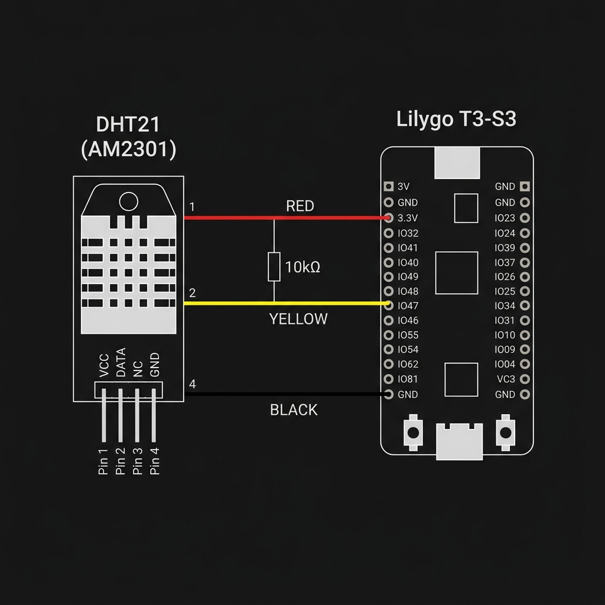

# Esquema de Ligação — DHT21 (AM2301) → Lilygo T3-S3



## Tabela de Conexão

| Cor do Fio | Pino DHT21 | Função | Lilygo T3-S3 |
|:---:|:---:|:---:|:---:|
| 🔴 Vermelho | Pin 1 | VCC | **3.3V** |
| 🟡 Amarelo | Pin 2 | DATA | **IO47** |
| — | Pin 3 | N/C | — |
| ⚫ Preto | Pin 4 | GND | **GND** |

> ⚠️ **Pull-up:** Instale um resistor de **10kΩ** entre os fios Vermelho (VCC) e Amarelo (DATA).

## Diagrama ASCII

```
DHT21 (AM2301)          Lilygo T3-S3
┌──────────┐
│ Pin 1 ───┼──── VERMELHO ───→ 3.3V
│ Pin 2 ───┼──── AMARELO  ───→ IO47
│ Pin 3    │     (N/C)
│ Pin 4 ───┼──── PRETO    ───→ GND
└──────────┘
              [10kΩ entre VCC e DATA]
```

## Definição no Firmware

```cpp
#define DHTPIN   47    // Pino IO47
#define DHTTYPE  DHT21
DHT dht(DHTPIN, DHTTYPE);
```
